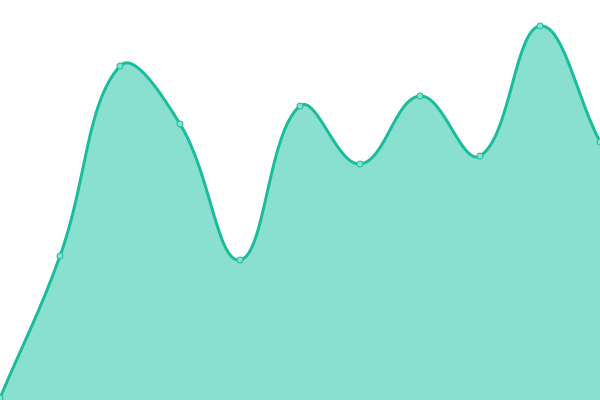
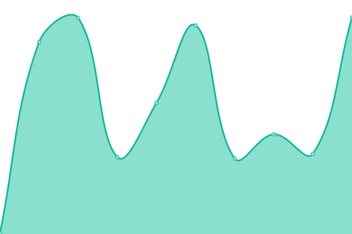
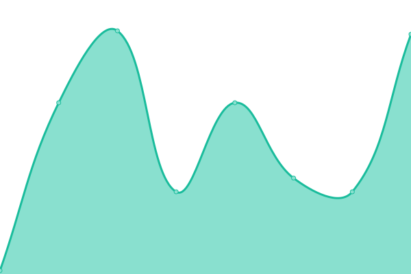
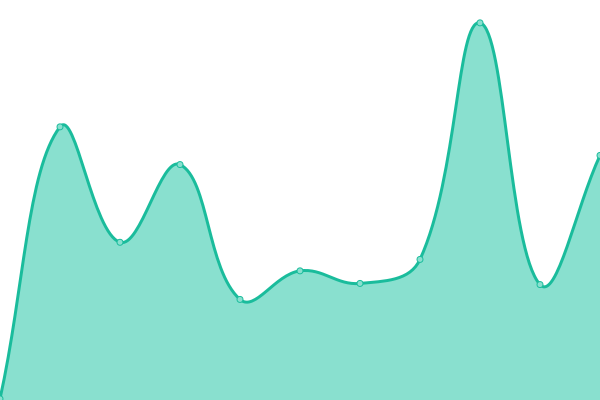

# [📈 Live Status](https://demo.upptime.js.org): <!--live status--> **🟩 All systems operational**

This repository contains the open-source uptime monitor and status page for [HappyDoc ](https://demo.upptime.js.org), powered by [Upptime](https://github.com/upptime/upptime).

With [Upptime](https://upptime.js.org), you can get your own unlimited and free uptime monitor and status page, powered entirely by a GitHub repository. We use [Issues](https://github.com/happy-doc/HappyStatus/issues) as incident reports, [Actions](https://github.com/happy-doc/HappyStatus/actions) as uptime monitors, and [Pages](https://demo.upptime.js.org) for the status page.

<!--start: status pages-->
<!-- This summary is generated by Upptime (https://github.com/upptime/upptime) -->
<!-- Do not edit this manually, your changes will be overwritten -->
<!-- prettier-ignore -->
| URL | Status | History | Response Time | Uptime |
| --- | ------ | ------- | ------------- | ------ |
|  [Web App](https://app.gohappydoc.com) | 🟩 Up | [web-app.yml](https://github.com/happy-doc/HappyStatus/commits/HEAD/history/web-app.yml) | 

 119ms
     
 | 

<a href="https://status.gohappydoc.com/history/web-app">100.00%</a>
    

|  [Transcription](https://service.gohappydoc.com/service-transcribe/healthcheck) | 🟩 Up | [transcription.yml](https://github.com/happy-doc/HappyStatus/commits/HEAD/history/transcription.yml) | 

 231ms
     
 | 

<a href="https://status.gohappydoc.com/history/transcription">100.00%</a>
    

|  [Document Generation](https://service.gohappydoc.com/api-server/healthcheck) | 🟩 Up | [document-generation.yml](https://github.com/happy-doc/HappyStatus/commits/HEAD/history/document-generation.yml) | 

 56ms
     
 | 

<a href="https://status.gohappydoc.com/history/document-generation">100.00%</a>
    

|  [OpenAI](https://status.openai.com/api/v2/status.json) | 🟩 Up | [open-ai.yml](https://github.com/happy-doc/HappyStatus/commits/HEAD/history/open-ai.yml) | 

 185ms
     
 | 

<a href="https://status.gohappydoc.com/history/open-ai">100.00%</a>
    

|  [Database](https://supa.happydoc.ai/rest/v1/app_versions?id=eq.1) | 🟩 Up | [database.yml](https://github.com/happy-doc/HappyStatus/commits/HEAD/history/database.yml) | 

 412ms
     
 | 

<a href="https://status.gohappydoc.com/history/database">100.00%</a>
    

<!--end: status pages-->

[**Visit our status website →**](https://demo.upptime.js.org)

## 📄 License

- Powered by: [Upptime](https://github.com/upptime/upptime)
- Code: [MIT](./LICENSE) © [Anand Chowdhary](https://anandchowdhary.com), supported by [Pabio](https://pabio.com)
- Data in the `./history` directory: [Open Database License](https://opendatacommons.org/licenses/odbl/1-0/)
